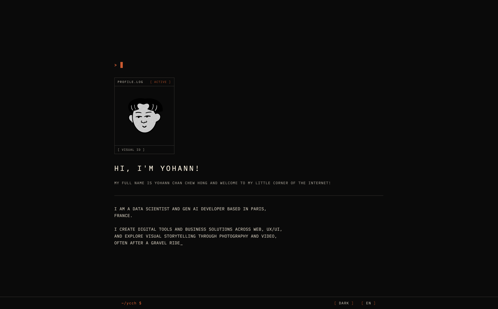

# cli-portfolio

A single-page portfolio built with React, Vite, and Tailwind CSS v4. Features a Neo-Brutalist / terminal CLI aesthetic — monospaced type, strict monochrome palette, 1 px structural lines, dark/light mode, bilingual support (EN/FR), typing animations, a photo gallery with fullscreen modal, and project previews inside terminal-chrome frames.




## Tech Stack

- **React 18** — UI library
- **Vite 6** — build tool & dev server
- **Tailwind CSS v4** — utility-first styling via `@tailwindcss/vite`
- **Motion** (Framer Motion) — scroll-triggered animations
- **i18next + react-i18next** — internationalisation (EN / FR)
- **Radix Dialog** — accessible fullscreen modals
- **Vitest + Testing Library** — unit tests

## Getting Started

```bash
npm install
npm run dev        # start dev server at localhost:5173
```

## Scripts

| Command | Description |
|---------|-------------|
| `npm run dev` | Start Vite dev server |
| `npm run build` | Production build → `dist/` |
| `npm run preview` | Preview production build locally |
| `npm test` | Run Vitest in watch mode |
| `npm run test:ui` | Vitest browser UI |
| `npm run test:cov` | Run tests with coverage report |

## Project Structure

```
src/
├── main.tsx              # Entry point
├── i18n.ts               # i18next configuration
├── locales/              # EN & FR translation files
├── styles/               # CSS — theme, fonts, Tailwind source
└── app/
    ├── App.tsx            # Main single-page component
    ├── components/        # Gallery, ProjectPreview, CliToolbar, etc.
    ├── constants/         # Shared UI constants (motion, typography)
    └── hooks/             # useDarkMode, useLanguage, useTypingEffect
```

## Gallery Data

Photo entries live in `public/gallery/index.json`. Place compressed images in `public/gallery/compressed/` and thumbnails in `public/gallery/thumbs/`.

## Deployment

```bash
npm run build
```

The `dist/` folder is a static site ready for any hosting provider (Vercel, Netlify, Cloudflare Pages, Azure Static Web Apps, etc.).

## License

© 2026 Yohann Chan Chew Hong. All rights reserved.
  